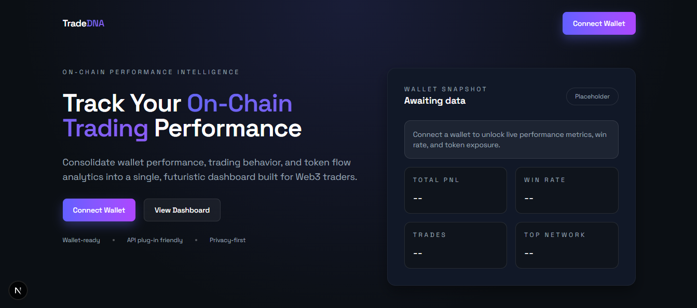

# TradeDNA

TradeDNA is a Web3 wallet analytics dashboard built with Next.js that helps traders understand wallet-level performance from on-chain activity.

It combines wallet connection, address search, transaction ingestion, token pricing, and derived analytics into one interface.



## What You Can Do

- Connect wallet on desktop and mobile (WalletConnect fallback for mobile/deep-link flow).
- Analyze a connected wallet or pasted wallet address.
- View wallet-level metrics:
- Total PnL
- Win rate
- Total successful transactions
- Most-used network
- Review recent trade activity and token-level performance.
- See cumulative PnL over time.
- Get an automatic trader profile classification:
- `Degen`
- `Swing Trader`
- `Diamond Hands`
- `Pro Trader`
- `Inactive`

## Current Chain Support

- Ethereum Mainnet (`chainId: 1`)

The architecture supports adding more chains later, but current production logic is Ethereum-focused.

## Product Surfaces

- Landing page: `/`
- Dashboard (connected wallet): `/dashboard`
- Search page (paste any wallet): `/search`
- Trending page placeholder: `/trending`
- API route for wallet analysis: `/api/analyze-wallet`

## Stack

- Next.js 16 (App Router)
- React 19
- TypeScript
- Tailwind CSS v4
- Ethers v6
- WalletConnect Ethereum Provider
- Recharts
- Sonner (toast notifications)

## Architecture Overview

1. User connects a wallet or enters an address.
2. Client calls `POST /api/analyze-wallet`.
3. Server pipeline (`analyzeWallet`) fetches wallet transfers from Alchemy.
4. Server fetches full transaction + receipt data from Infura.
5. Logs are decoded for ERC-20 transfer events.
6. Trade heuristics build buy/sell sides from transfers.
7. DexScreener prices are fetched for token valuation.
8. Derived analytics are computed:
9. total PnL
10. win rate
11. PnL series
12. trader classification
13. token performance table
14. JSON response is rendered in dashboard/search UI.

## Data Flow Details

### Transaction Collection

- File: `src/lib/apis/transactions.ts`
- Uses Alchemy `alchemy_getAssetTransfers` for inbound and outbound transfers.
- Uses Infura JSON-RPC to hydrate transactions and receipts.
- Includes successful status, timestamp, logs, and native value estimation.

### Trade Construction

- File: `src/lib/services/walletAnalysis.ts`
- ERC-20 `Transfer` logs are decoded and filtered to wallet-relevant transfers.
- Heuristic selects largest incoming/outgoing transfer as trade legs.
- Handles native-side quote fallback when one side is missing.

### Pricing

- File: `src/lib/apis/dexscreener.ts`
- Fetches token price by address and picks best-liquidity pair.
- Uses WETH pricing to estimate native transfer USD value.

### Analytics

- Files in `src/lib/analytics/*`
- `pnl.ts`: cumulative PnL and total PnL.
- `winrate.ts`: profitable trades ratio.
- `traderType.ts`: rule-based profile classification.

## Project Structure

- `src/app` App Router pages, layout, API route.
- `src/components` Reusable UI and wallet connection components.
- `src/lib/apis` External API clients and blockchain fetch logic.
- `src/lib/services` Orchestration/service layer for analysis.
- `src/lib/analytics` Derived metrics and classification logic.
- `public` Static assets including project logo `tradedna-logo.svg`.

## Environment Variables

Create `.env.local` in the project root:

```bash
NEXT_PUBLIC_WALLETCONNECT_PROJECT_ID=your_walletconnect_project_id
NEXT_PUBLIC_WALLETCONNECTPROJECT_ID=your_walletconnect_project_id
NEXT_PUBLIC_ALCHEMY_API_KEY=your_alchemy_api_key
NEXT_PUBLIC_INFURA_API_KEY=your_infura_api_key
NEXT_PUBLIC_DEXSCREENER_API_KEY=your_dexscreener_api_key_optional
```

### Notes

- `NEXT_PUBLIC_WALLETCONNECT_PROJECT_ID` is the primary WalletConnect key.
- `NEXT_PUBLIC_WALLETCONNECTPROJECT_ID` is supported as compatibility fallback.
- `NEXT_PUBLIC_DEXSCREENER_API_KEY` is optional.
- `NEXT_PUBLIC_ALCHEMY_API_KEY` and `NEXT_PUBLIC_INFURA_API_KEY` are required for transaction analysis.
- `NEXT_PUBLIC_*` values are baked at build time in production deployments.

## Local Development

Install dependencies:

```bash
npm install
```

Run development server:

```bash
npm run dev
```

Open:

```text
http://localhost:3000
```

## Scripts

```bash
npm run dev
npm run build
npm run start
npm run lint
```

## Why `npm run dev` Uses Webpack

This project currently runs local dev with:

```bash
next dev --webpack
```

Reason:

- Turbopack produced environment-specific module-resolution issues in this workspace path.
- Build and production runtime remain Next.js standard.

## API Reference

### `POST /api/analyze-wallet`

Request body:

```json
{
  "address": "0x..."
}
```

Success response (shape):

```json
{
  "totalTransactions": 0,
  "totalTrades": 0,
  "pnl": 0,
  "winRate": 0,
  "traderType": {
    "type": "Inactive",
    "riskLevel": "Low",
    "description": "No recent trading activity detected."
  },
  "trades": [],
  "pnlSeries": [],
  "recentTrades": [],
  "mostUsedNetwork": "Unknown",
  "tokensPerformance": []
}
```

Error responses:

- `400` when address is missing.
- `500` when upstream APIs fail or processing errors occur.

## Wallet Connection Behavior (Desktop + Mobile)

- If injected provider exists (`window.ethereum`), app uses injected wallet flow.
- If no injected provider exists, app falls back to WalletConnect.
- Mobile browsers typically use WalletConnect path.
- User-facing error messages are intentionally non-technical.

## Deploying to Vercel

1. Push repository to GitHub.
2. Import project in Vercel.
3. Add environment variables in `Project Settings -> Environment Variables`:
4. `NEXT_PUBLIC_WALLETCONNECT_PROJECT_ID`
5. `NEXT_PUBLIC_WALLETCONNECTPROJECT_ID` (optional compatibility)
6. `NEXT_PUBLIC_ALCHEMY_API_KEY`
7. `NEXT_PUBLIC_INFURA_API_KEY`
8. `NEXT_PUBLIC_DEXSCREENER_API_KEY` (optional)
9. Redeploy after every env change.

## Troubleshooting

### "WalletConnect not configured" in production/mobile

- Confirm WalletConnect env variable exists in Vercel.
- Redeploy after setting env variables.
- Ensure variable names are exact.

### Build fails on Google Fonts fetch

- `next/font/google` requires network access during build.
- Ensure CI/build environment has outbound internet access to Google Fonts.

### Empty analytics

- Some wallets have no usable ERC-20 transfer-derived trade data in sampled history.
- Upstream RPC/API limits or intermittent failures can reduce returned data.

### Recharts width/height warnings during build

- Known warning during server rendering.
- Does not block successful build/start.

## Known Limitations

- Ethereum-only by default.
- Trade reconstruction uses heuristics and may not match DEX-level execution semantics exactly.
- Prices are estimated from current liquidity sources and may differ from execution-time fill prices.
- Trending page is scaffolded and not yet connected to a live aggregation pipeline.

## Branding

- Primary logo asset: `public/tradedna-logo.svg`

## Disclaimer

TradeDNA provides analytical estimates from on-chain and third-party data.
It is not financial advice and should not be used as the sole basis for trading decisions.
